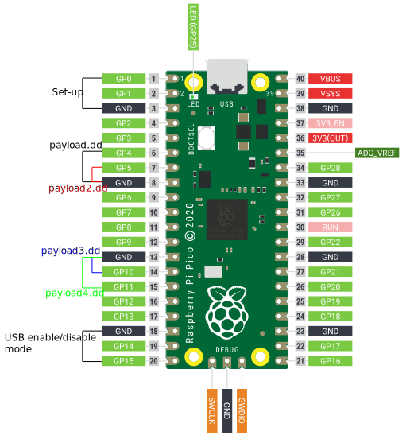

<h1 align="center">pico-ducky</h1>

<div align="center">
  <strong>Make a cheap but powerful USB Rubber Ducky with a Raspberry Pi Pico</strong>
</div>

<br />


# Install Instructions

Install and have your USB Rubber Ducky working in less than 5 minutes.

1. Clone the repo to get a local copy of the files. `git clone https://github.com/dbisu/pico-ducky.git`

2. Download [CircuitPython for the Raspberry Pi Pico](https://circuitpython.org/board/raspberry_pi_pico/). *Updated to 9.0.5*
   Download [CircuitPython for the Raspberry Pi Pico W](https://circuitpython.org/board/raspberry_pi_pico_w/). *Updated to 9.0.5*
   Download [CircuitPython for the Adafruit RP2040 Trinkey](https://circuitpython.org/board/adafruit_qt2040_trinkey/). *Updated to 9.0.5*

3. Plug the device into a USB port while holding the boot button. It will show up as a removable media device named `RPI-RP2`.

4. Copy the downloaded `.uf2` file to the root of the Pico (`RPI-RP2`). The device will reboot and after a second or so, it will reconnect as `CIRCUITPY`.

5. Download `adafruit-circuitpython-bundle-9.x-mpy-YYYYMMDD.zip` [here](https://github.com/adafruit/Adafruit_CircuitPython_Bundle/releases/latest) and extract it outside the device.
**NB : make sure to use the correct version of libs to the firmware installed**

6. Navigate to `lib` in the recently extracted folder and copy to `Volumes/CIRCUITPY/lib` : 
 - `adafruit_debouncer.mpy` 
 - `adafruit_hid`
 - `adafruit_ticks.mpy`
 - `asyncio`
 - `adafruit_wsgi`

7. From  `src/`, copy all the `.py` files to the root of device :
 - `boot.py`
 - `duckyinpython.py`
 - `code.py`
 - `webapp.py`
 - `wsgiserver.py` 
 *NB: the folder`code_rpico` contains original code compatible with pico and pico W. The code in `src` should work for these two devices along with the adafruit Trinkey RP2040.*
 
8. *For Pico W Only* Create the file `secrets.py` in the root of the Pico W. This contains the AP name and password to be created by the Pico W.  
`secrets = { 'ssid' : "BadAPName", 'password' : "badpassword" }`

9. Find a script [here](https://github.com/hak5/usbrubberducky-payloads) or [create your own one using Ducky Script](https://docs.hak5.org/hak5-usb-rubber-ducky/ducky-script-basics/hello-world) and save it as `payload.dd` in the Pico. Currently, pico-ducky only supports DuckyScript 1.0, not 3.0.
 - There are some payloads in the `payloads` folder of this repo.
 - the example `payload.dd` opens Notepad in Windows and type "Hello World!"

10. Be careful, if your device isn't in [setup mode](#setup-mode), the device will reboot and after half a second, the script will run.

11. **Please note:** by default Pico W will not show as a USB drive

### Error with MacOS Sonoma copying files into `CIRCUITPY/`

see : [Write-up in Circuit Python website](https://learn.adafruit.com/welcome-to-circuitpython/troubleshooting#macos-sonoma-14-dot-x-disk-errors-writing-to-circuitpy-3160304)

macOS Sonoma before 14.4 beta 2 takes many seconds to complete writes to small FAT drives, 8MB or smaller. This causes errors when writing to CIRCUITPY. The best solution is to remount the CIRCUITPY drive after it is automatically mounted. Or consider downgrading back to Ventura if that works for you. This problem is being tracked in CircuitPython [GitHub issue 8449](https://github.com/adafruit/circuitpython/issues/8449).

Here is a shell script to do this remount conveniently (courtesy @czei in GitHub). Copy the code here into a file named, say, remount-CIRCUITPY.sh. Place the file in a directory on your PATH, or in some other convenient place.

macOS Sonoma 14.4 beta and after does not have the problem above, but does take an inordinately long time to write to FAT drives of size 1GB or less (40 times longer than 2GB drives). This problem is being tracked in [CircuitPython GitHub issue 8918](https://github.com/adafruit/circuitpython/issues/8918).

``` bash
#!/bin/sh
#
# This works around bug where, by default, macOS 14.x writes part of a file 
# immediately, and then doesn't update the directory for 20-60 seconds, causing
# the file system to be corrupted.
#

disky=`df | grep CIRCUITPY | cut -d" " -f1`
sudo umount /Volumes/CIRCUITPY
sudo mkdir /Volumes/CIRCUITPY
sleep 2
sudo mount -v -o noasync -t msdos $disky /Volumes/CIRCUITPY
```

then `chmod +x remount-CIRCUITPY.sh`.

Place the file in a directory on your `PATH`, or in some other convenient place.

Now, each time you plug in or reset your CIRCUITPY board, run the file `remount-CIRCUITPY.sh`. You can run it in a Terminal window or you may be able to place it on the desktop or in your dock to run it just by double-clicking.

This will be something of a nuisance but it is the safest solution.

### Pico W Web Service
The Pico W AP defaults to ip address `192.168.4.1`.  You should be able to find the webservice at `http://192.168.4.1:80`  

The following endpoints are available on the webservice:
```
/
/new
/ducky
/edit/<filename>
/write/<filename>
/run/<filename>
```

API endpoints
```
/api/run/<filenumber>
```

## Setup mode

To edit the payload, enter setup mode by connecting the pin 1 (`GP0`) to pin 3 (`GND`), this will stop the pico-ducky from injecting the payload in your own machine.
The easiest way to do so is by using a jumper wire between those pins as seen bellow.


## USB enable/disable mode

If you need the pico-ducky to not show up as a USB mass storage device for stealth, follow these instructions.  
- Enter setup mode.    
- Copy your payload script to the pico-ducky.  
- Disconnect the pico from your host PC.
- Connect a jumper wire between pin 18 (`GND`) and pin 20 (`GPIO15`).  
This will prevent the pico-ducky from showing up as a USB drive when plugged into the target computer.  
- Remove the jumper and reconnect to your PC to reprogram.  

Pico: The default mode is USB mass storage enabled.   
Pico W: The default mode is USB mass storage **disabled**  


## Multiple payloads

Multiple payloads can be stored on the Pico and Pico W.  
To select a payload, ground one of these pins:
- GP4 - payload.dd
- GP5 - payload2.dd
- GP10 - payload3.dd
- GP11 - payload4.dd

## Changing Keyboard Layouts

Copied from [Neradoc/Circuitpython_Keyboard_Layouts](https://github.com/Neradoc/Circuitpython_Keyboard_Layouts/blob/main/PICODUCKY.md)  

#### How to use one of these layouts with the pico-ducky repository.

**Go to the [latest release page](https://github.com/Neradoc/Circuitpython_Keyboard_Layouts/releases/latest), look if your language is in the list.**

#### If your language/layout is in the bundle

Download the `py` zip, named `circuitpython-keyboard-layouts-py-XXXXXXXX.zip`

**NOTE: You can use the mpy version targetting the version of Circuitpython that is on the device, but on Raspberry Pi Pico you don't need it - they only reduce file size and memory use on load, which the pico has plenty of.**

#### If your language/layout is not in the bundle

Try the online generator, it should get you a zip file with the bundles for yout language

https://www.neradoc.me/layouts/

#### Now you have a zip file

#### Find your language/layout in the lib directory

For a language `LANG`, copy the following files from the zip's `lib` folder to the `lib` directory of the board.  
**DO NOT** modify the adafruit_hid directory. Your files go directly in `lib`.  
**DO NOT** change the names or extensions of the files. Just pick the right ones.  
Replace `LANG` with the letters for your language of choice.

- `keyboard_layout_win_LANG.py`
- `keycode_win_LANG.py`

Don't forget to get [the adafruit_hid library](https://github.com/adafruit/Adafruit_CircuitPython_HID/releases/latest).

This is what it should look like **if your language is French for example**.


#### Modify the pico-ducky code to use your language file:

At the start of the file `duckyinpython.py` comment out these lines:

```py
from adafruit_hid.keyboard_layout_us import KeyboardLayoutUS as KeyboardLayout
from adafruit_hid.keycode import Keycode
```

Uncomment these lines:  
*Replace `LANG` with the letters for your language of choice. The name must match the file (without the py or mpy extension).*
```py
from keyboard_layout_win_LANG import KeyboardLayout
from keycode_win_LANG import Keycode
```

##### Example:  Set to German Keyboard (WIN_DE)

```py
from keyboard_layout_win_de import KeyboardLayout
from keycode_win_de import Keycode
```

Copy the files keyboard_layout_win_de.mpy and keycode_win_de.mpy to the /lib folder on the Pico board
```
adafruit_hid/
keyboard_layout_win_de.mpy
keycode_win_de.mpy
```

## Full pinout



## Useful links and resources

### How to recover your Pico if it becomes corrupted or doesn't boot.

[Reset Instructions](RESET.md)

### Installation Tool

[raspberrydeveloper](https://github.com/raspberrydeveloper) Created a tool to convert a blank RPi Pico to a ducky.  
You can find the tool [here](https://github.com/raspberrydeveloper/pyducky)

### Docs

[CircuitPython](https://circuitpython.readthedocs.io/en/6.3.x/README.html)

[CircuitPython HID](https://learn.adafruit.com/circuitpython-essentials/circuitpython-hid-keyboard-and-mouse)

[Ducky Script](https://github.com/hak5darren/USB-Rubber-Ducky/wiki/Duckyscript)

### Video tutorials

[pico-ducky tutorial by **NetworkChuck**](https://www.youtube.com/watch?v=e_f9p-_JWZw)

[USB Rubber Ducky playlist by **Hak5**](https://www.youtube.com/playlist?list=PLW5y1tjAOzI0YaJslcjcI4zKI366tMBYk)

[CircuitPython tutorial on the Raspberry Pi Pico by **DroneBot Workshop**](https://www.youtube.com/watch?v=07vG-_CcDG0)


## Related Projects

[Defcon31-ducky](https://github.com/iot-pwn/defcon31-ducky)  
There are still a few of these available to purchase, US only.

# Full pinout
